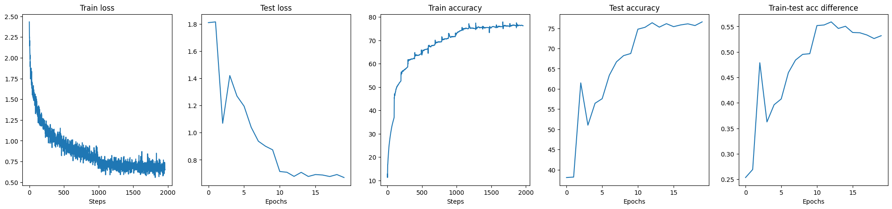
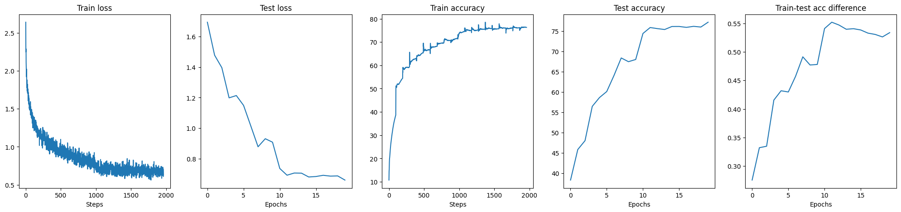
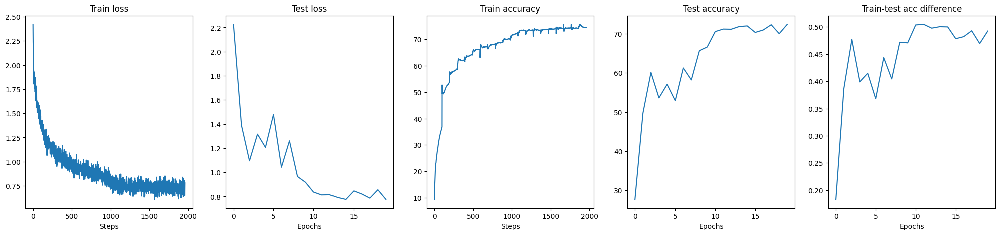

# Assignment S8

## Overview
This repo contains my submission for the 8th assignment of TSAI ERA V1 Course. The task was to train a fully convolutional neural network that satisfies the following constraints on the CIFAR10 dataset

- Skeleton of C1 C2 c3 P1 C4 C5 C6 c7 P2 C8 C9 C10 GAP c11 where
  - C —> 3x3 conv layer
  - c —> 1x1 conv layer
  - P —> 2x2 Max Pooling layer
  - GAP —> Global Avg Pooling layer
- ~50K parameters
- Trained for not longer than 20 epochs
- 3 models in total (one per Batch, Group and Layer Normalization)
- 70%+ test accuracy for each model

Owing to shortage of time, I did not evaluate misclassified images. This will be included in future work

## Model Architecture

Find below the architecture of the model that used Batch Normalization layers. For the other 2 models, the batch normalization layer was swapped with the layer and group normalization layers.

```
==========================================================================================
Layer (type:depth-idx)                   Output Shape              Param #
==========================================================================================
Net                                      [10]                      --
├─ConvLayer: 1-1                         --                        --
│    └─Conv2d: 2-1                       [1, 12, 32, 32]           324
│    └─BatchNorm2d: 2-2                  [1, 12, 32, 32]           24
│    └─Dropout: 2-3                      [1, 12, 32, 32]           --
├─ConvLayer: 1-2                         --                        --
│    └─Conv2d: 2-4                       [1, 12, 32, 32]           1,296
│    └─BatchNorm2d: 2-5                  [1, 12, 32, 32]           24
│    └─Dropout: 2-6                      [1, 12, 32, 32]           --
├─ConvLayer: 1-3                         --                        --
│    └─Conv2d: 2-7                       [1, 12, 32, 32]           144
│    └─BatchNorm2d: 2-8                  [1, 12, 32, 32]           24
│    └─Dropout: 2-9                      [1, 12, 32, 32]           --
├─MaxPool2d: 1-4                         [1, 12, 16, 16]           --
├─ConvLayer: 1-5                         --                        --
│    └─Conv2d: 2-10                      [1, 22, 16, 16]           2,376
│    └─BatchNorm2d: 2-11                 [1, 22, 16, 16]           44
│    └─Dropout: 2-12                     [1, 22, 16, 16]           --
├─ConvLayer: 1-6                         --                        --
│    └─Conv2d: 2-13                      [1, 22, 16, 16]           4,356
│    └─BatchNorm2d: 2-14                 [1, 22, 16, 16]           44
│    └─Dropout: 2-15                     [1, 22, 16, 16]           --
├─ConvLayer: 1-7                         --                        --
│    └─Conv2d: 2-16                      [1, 22, 16, 16]           4,356
│    └─BatchNorm2d: 2-17                 [1, 22, 16, 16]           44
│    └─Dropout: 2-18                     [1, 22, 16, 16]           --
├─ConvLayer: 1-8                         --                        --
│    └─Conv2d: 2-19                      [1, 22, 16, 16]           484
│    └─BatchNorm2d: 2-20                 [1, 22, 16, 16]           44
│    └─Dropout: 2-21                     [1, 22, 16, 16]           --
├─MaxPool2d: 1-9                         [1, 22, 8, 8]             --
├─ConvLayer: 1-10                        --                        --
│    └─Conv2d: 2-22                      [1, 40, 8, 8]             7,920
│    └─BatchNorm2d: 2-23                 [1, 40, 8, 8]             80
│    └─Dropout: 2-24                     [1, 40, 8, 8]             --
├─ConvLayer: 1-11                        --                        --
│    └─Conv2d: 2-25                      [1, 40, 8, 8]             14,400
│    └─BatchNorm2d: 2-26                 [1, 40, 8, 8]             80
│    └─Dropout: 2-27                     [1, 40, 8, 8]             --
├─ConvLayer: 1-12                        --                        --
│    └─Conv2d: 2-28                      [1, 40, 8, 8]             14,400
│    └─BatchNorm2d: 2-29                 [1, 40, 8, 8]             80
│    └─Dropout: 2-30                     [1, 40, 8, 8]             --
├─AdaptiveAvgPool2d: 1-13                [1, 40, 1, 1]             --
├─ConvLayer: 1-14                        --                        20
│    └─Conv2d: 2-31                      [1, 10, 1, 1]             400
==========================================================================================
Total params: 50,964
Trainable params: 50,964
Non-trainable params: 0
Total mult-adds (M): 7.12
==========================================================================================
Input size (MB): 0.01
Forward/backward pass size (MB): 1.07
Params size (MB): 0.20
Estimated Total Size (MB): 1.29
==========================================================================================
```
## Performance

### Batch Normalization model

- Max training accuracy: 76.27%
- Max test accuracy: 76.58%



### Layer Normalization model

- Max training accuracy: 76.28%
- Max test accuracy: 77.17%



### Group Normalization model

- Max training accuracy: 74.50%
- Max test accuracy: 72.42%



## Strategies & Observations

- Since the skeleton was fixed, experimentation chiefly focused on augmentation, learning rates and regularization
- Image augmentation proved to be the most effective strategy given the diversity of the images in the training set and how they could be transformed to create more class samples without issues
- Simple epoch-based learning rate scheduler was used, which also proved beneficial for stabilising training in the later stages
- More training stability from L2 regularisation was also observed. Specific values were chosen from an architecture that did well in DAWNBench, which was similar to the skeleton shared
- As instructed, layers were added to create skip connections which allowed for quick accuracy pickup in fewer epochs
- Layer normalization proved to produce a more stable training accuracy curve with a higher test accuracy value, compared to Batch Normalization. It was also surprisingly more stable than group normalization
- Overfitting is mildly noticeable in the group normalization model. The other 2 models demonstrate train & test going hand in hand in a 0.2% band
